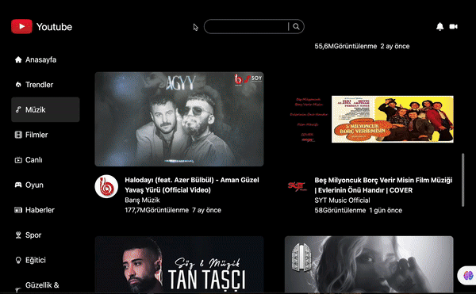

<h2>YouTube Clone</h2>

This project is a YouTube clone developed using React Vite. It 

incorporates various libraries including 
-react-icons, 

-react-router-dom, 

-axios, 

-react-player, 

-moment, 

-millify, 

-tailwind. 

The React context structure is utilized for state management, and 

data is fetched from APIs. Users can browse videos across 10 

different categories such as trends, news, sports, and movies, with 

filtering options available to easily find specific videos of 

interest. Clicking on a video navigates to a detailed page 

displaying information such as subscriber count, view count, upload 

date, and more.

<h3> Screenshot</h3>

API: https://rapidapi.com/ytjar/api/yt-api
